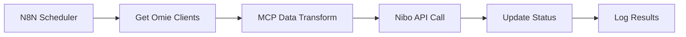

# 🔄 Basic ERP Integration Example

## 📋 **OVERVIEW**

Este exemplo demonstra como criar uma integração básica entre dois ERPs usando N8N + MCP.

### **🎯 Caso de Uso:**
- **Fonte**: Omie ERP (clientes)
- **Destino**: Nibo Plus (cadastro contábil)
- **Frequência**: Sincronização a cada 30 minutos
- **Volume**: 50-500 registros por execução

---

## 🏗️ **ARQUITETURA**



---

## 📁 **ARQUIVOS INCLUÍDOS**

```
basic-erp-integration/
├── README.md                      # Este arquivo
├── workflow.json                  # Workflow N8N principal
├── mcp-config.json               # Configuração MCP server
├── test-data.json                # Dados de teste
├── credentials-template.json      # Template de credenciais
└── deployment/
    ├── docker-compose.yml        # Deploy local
    └── production.yml            # Config produção
```

---

## 🚀 **SETUP RÁPIDO**

### **1️⃣ Pré-requisitos**
```bash
# Verificar se N8N está instalado
n8n --version

# Verificar MCP server rodando
curl http://localhost:3001/health
```

### **2️⃣ Importar Workflow**
```bash
# Via N8N CLI
n8n import:workflow --input=./workflow.json

# Ou via interface web:
# 1. Abrir N8N: http://localhost:5678
# 2. Settings > Import/Export > Import
# 3. Selecionar workflow.json
```

### **3️⃣ Configurar Credenciais**
```bash
# Copiar template
cp credentials-template.json credentials.json

# Editar com suas credenciais
nano credentials.json
```

### **4️⃣ Testar Execução**
```bash
# Executar manualmente
n8n execute --workflow="Basic ERP Integration"

# Ou via webhook:
curl -X POST http://localhost:5678/webhook/sync-erp \
  -H "Content-Type: application/json" \
  -d '{"source": "omie", "target": "nibo", "entity": "clients"}'
```

---

## 🔧 **CONFIGURAÇÃO DETALHADA**

### **📊 Workflow Nodes Explicados**

#### **1. Cron Trigger**
```json
{
  "name": "Schedule Sync",
  "type": "n8n-nodes-base.cron",
  "parameters": {
    "rule": {
      "interval": [{"field": "cronExpression", "value": "0 */30 * * * *"}]
    }
  },
  "description": "Executa a cada 30 minutos"
}
```

#### **2. Get Omie Clients**
```json
{
  "name": "Get Omie Clients",
  "type": "n8n-nodes-base.httpRequest",
  "parameters": {
    "method": "POST",
    "url": "https://app.omie.com.br/api/v1/geral/clientes/",
    "headers": {
      "Content-Type": "application/json"
    },
    "body": {
      "call": "ListarClientes",
      "app_key": "={{ $credentials.omie.app_key }}",
      "app_secret": "={{ $credentials.omie.app_secret }}",
      "param": [{
        "pagina": 1,
        "registros_por_pagina": 50,
        "apenas_importado_api": "N"
      }]
    }
  }
}
```

#### **3. MCP Data Transform**
```json
{
  "name": "Transform via MCP",
  "type": "n8n-nodes-base.httpRequest",
  "parameters": {
    "method": "POST",
    "url": "http://localhost:3001/call",
    "headers": {
      "Content-Type": "application/json"
    },
    "body": {
      "method": "transform_erp_data",
      "params": {
        "source_erp": "omie",
        "target_erp": "nibo",
        "entity_type": "clients",
        "data": "={{ $json.clientes_cadastro }}"
      }
    }
  }
}
```

#### **4. Sync to Nibo**
```json
{
  "name": "Sync to Nibo",
  "type": "n8n-nodes-base.function",
  "parameters": {
    "functionCode": "// Process MCP transformation result\nconst transformedData = items[0].json.result.transformed_data;\nconst results = [];\n\nfor (const client of transformedData) {\n  try {\n    // Call Nibo API for each client\n    const niboResponse = await $http.request({\n      method: 'POST',\n      url: 'https://api.nibo.com.br/v1/clients',\n      headers: {\n        'Authorization': `Bearer ${$credentials.nibo.access_token}`,\n        'Content-Type': 'application/json'\n      },\n      data: client\n    });\n    \n    results.push({\n      omie_id: client.codigo_cliente_omie,\n      nibo_id: niboResponse.data.id,\n      status: 'success',\n      synced_at: new Date().toISOString()\n    });\n    \n  } catch (error) {\n    results.push({\n      omie_id: client.codigo_cliente_omie,\n      status: 'error',\n      error: error.message,\n      failed_at: new Date().toISOString()\n    });\n  }\n}\n\nreturn results.map(r => ({ json: r }));"
  }
}
```

---

## 🧪 **TESTES**

### **📋 Test Scenarios**

#### **Teste 1: Happy Path**
```bash
# Dados de entrada válidos
{
  "source": "omie",
  "target": "nibo", 
  "entity": "clients",
  "test_mode": true
}

# Resultado esperado:
{
  "success": true,
  "processed": 25,
  "synced": 25,
  "errors": 0,
  "execution_time": "15.2s"
}
```

#### **Teste 2: Error Handling**
```bash
# Simular API indisponível
{
  "source": "omie_unavailable",
  "target": "nibo",
  "entity": "clients"
}

# Resultado esperado:
{
  "success": false,
  "error": "Source API unavailable",
  "retry_scheduled": true,
  "next_retry": "2025-01-23T11:00:00Z"
}
```

#### **Teste 3: Large Dataset**
```bash
# Volume alto
{
  "source": "omie",
  "target": "nibo",
  "entity": "clients",
  "batch_size": 500
}

# Resultado esperado:
{
  "success": true,
  "processed": 500,
  "synced": 495,
  "errors": 5,
  "batches": 10,
  "execution_time": "2.5min"
}
```

---

## 📊 **MONITORING**

### **📈 Key Metrics**
```yaml
performance_metrics:
  - execution_time: "< 30 segundos para 50 registros"
  - success_rate: "> 95%"
  - api_response_time: "< 2 segundos por chamada"
  - memory_usage: "< 256MB"

business_metrics:
  - sync_frequency: "A cada 30 minutos"
  - data_freshness: "< 30 minutos"
  - error_rate: "< 5%"
  - manual_intervention: "< 1 vez por semana"
```

### **🚨 Alerts Configuration**
```yaml
critical_alerts:
  - sync_failure_rate > 10%: "Immediate notification"
  - api_response_time > 10s: "Warning notification"
  - execution_timeout: "Critical notification"

warning_alerts:
  - sync_delay > 1h: "Delayed notification"
  - error_rate > 2%: "Warning notification"
  - memory_usage > 80%: "Performance notification"
```

---

## 🔄 **DEPLOYMENT**

### **🐳 Docker Local**
```bash
# Usar Docker Compose
cd deployment/
docker-compose up -d

# Verificar services
docker-compose ps
```

### **☁️ Production Deployment**
```bash
# Deploy em servidor
scp -r . user@server:/opt/erp-integration/
ssh user@server

# Setup environment
cd /opt/erp-integration/
cp production.yml docker-compose.yml
docker-compose up -d

# Configure monitoring
docker-compose -f monitoring.yml up -d
```

---

## 🐛 **TROUBLESHOOTING**

### **❌ Problemas Comuns**

#### **Erro: "MCP Server Connection Failed"**
```bash
# Verificar se MCP server está rodando
curl http://localhost:3001/health

# Se não responder:
cd ../mcp-server/
python mcp_server.py

# Verificar logs
tail -f mcp-server.log
```

#### **Erro: "Omie API Rate Limited"**
```bash
# Ajustar batch size no workflow
# Node: "Get Omie Clients" > parameters > body > param
{
  "registros_por_pagina": 25  # Reduzir de 50 para 25
}

# Adicionar delay entre chamadas
# Node: "Add Delay" após cada API call
{
  "amount": 2,
  "unit": "seconds"
}
```

#### **Erro: "Nibo Authentication Failed"**
```bash
# Verificar credentials
n8n credentials:list

# Refresh token se necessário
curl -X POST https://api.nibo.com.br/oauth/token \
  -d "grant_type=refresh_token" \
  -d "refresh_token=YOUR_REFRESH_TOKEN"
```

---

## 📚 **NEXT STEPS**

### **🚀 Melhorias Possíveis**

1. **Incremental Sync**: Sincronizar apenas mudanças
2. **Conflict Resolution**: AI para resolver conflitos de dados
3. **Multi-directional**: Sync bidirecional
4. **Real-time**: Webhooks para sync imediato
5. **Analytics**: Dashboard de performance

### **🔧 Customizações**

1. **Outros ERPs**: Adaptar para SAP, Totvs, etc.
2. **Mais Entidades**: Produtos, pedidos, notas fiscais
3. **Business Rules**: Validações específicas
4. **Notifications**: Slack, email, WhatsApp
5. **Approval Workflow**: Aprovação manual para mudanças críticas

---

## 📞 **SUPORTE**

- **🐛 Issues**: [GitHub Issues](https://github.com/Uptax-creator/n8n-mcp-business-integrations/issues)
- **📖 Docs**: [Documentation](../docs/)
- **💬 Community**: [Discussions](https://github.com/Uptax-creator/n8n-mcp-business-integrations/discussions)

**✅ Este exemplo fornece uma base sólida para integrações ERP usando N8N + MCP!**